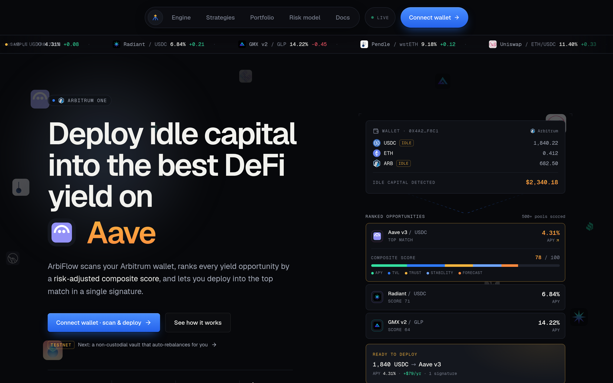
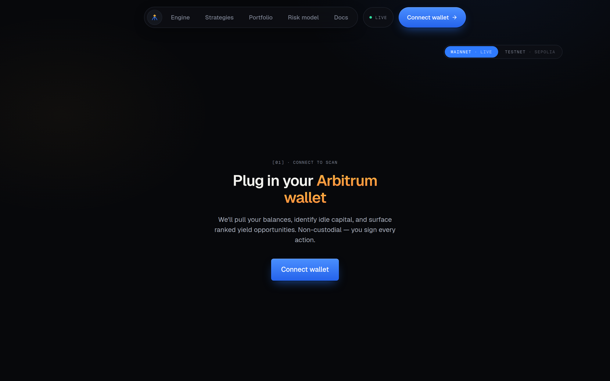
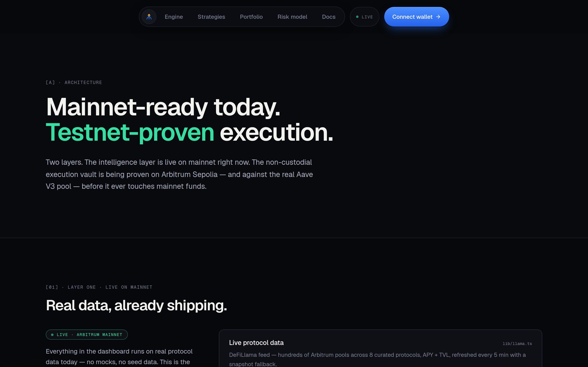
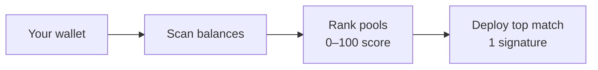
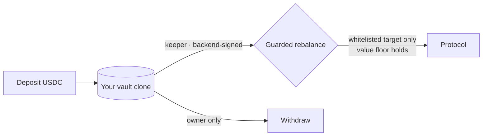

<div align="center">

# ArbiFlow

**Deploy idle capital into optimized DeFi yield.**
Arbitrum-native · 0–100 composite score · non-custodial

[](https://arbiscan.io)
[](https://sepolia.arbiscan.io/address/0xB2AA9601b085350fD0eE12697C829BBa51f4d56E)
[](#license)

**🔗 [Live app](https://arbiflow-one.vercel.app)** · 🔍 [Live demo vault on Arbiscan](https://sepolia.arbiscan.io/address/0xB2AA9601b085350fD0eE12697C829BBa51f4d56E) · 🧱 [Architecture](https://arbiflow-one.vercel.app/architecture) · 📡 [API docs](https://arbiflow-one.vercel.app/api-docs) · 🎬 Demo video: _add link_

</div>



---

## The moat

Robo-advisors for DeFi usually ask you to hand over your funds. ArbiFlow doesn't.

**ArbiFlow curates and cryptographically signs every move — and the contract guarantees it can _never_ withdraw your funds.** The backend decides *where* capital may go and signs it (EIP-712); the chain enforces that only whitelisted targets are touched, that portfolio value can't drop on a rebalance, and that **only you** can withdraw. Curate and route — never custody.

## What's real right now

| Layer | Status | Proof |
|---|---|---|
| **Intelligence** — scan your wallet, rank ~500 Arbitrum pools by a 0–100 risk-adjusted score, deploy the top match in one signature | 🟢 **Live · Arbitrum mainnet** | [Open the dashboard →](https://arbiflow-one.vercel.app/app) |
| **Delegation vault** — non-custodial per-user vault, auto-rebalanced by a keeper every ~35s; owner-only withdrawals | 🟡 **Testnet-proven · Arbitrum Sepolia** | [Live demo vault, rebalancing on-chain ↗](https://sepolia.arbiscan.io/address/0xB2AA9601b085350fD0eE12697C829BBa51f4d56E) |
| **Execution vs. real markets** — the same guarded rebalance against the real Aave V3 pool | 🔵 **Foundry fork test ✓** | `contracts/test/RebalanceForkAave.t.sol` vs. Aave V3 [`0x794a…14aD`](https://arbiscan.io/address/0x794a61358D6845594F94dc1DB02A252b5b4814aD) |

<p align="center">
  
  
</p>

## How it works

**Intelligence layer (live on mainnet):**



The score is a transparent composite — **APY 40 · TVL 20 · Trust 15 · Stability 15 · Forecast 10 = 100** (`lib/score.ts`), over ~500 curated Arbitrum pools from DeFiLlama (8 anchor protocols), refreshed ~every 5 min with a snapshot fallback.

**Delegation vault (proving on testnet):**



Deposit once; a backend-signed keeper rebalances into the top-scoring whitelisted protocol every ~35s — verifiable live on the [demo vault](https://sepolia.arbiscan.io/address/0xB2AA9601b085350fD0eE12697C829BBa51f4d56E).

## Security model

- **Non-custodial by construction** — funds sit in *your own* vault clone; only `owner` can `withdraw`.
- **Curate + sign, never drain** — the backend signs *where* funds may go (EIP-712, bound to a nonce + deadline); the chain enforces it.
- **Whitelisted targets only** — every rebalance call must hit an admin-whitelisted target.
- **Value floor on every move** — portfolio USD value can't drop more than `maxSlippageBps` (~1%) across a batch.
- **Always-open escape hatch** — `emergencyWithdraw` lets the owner exit even if the keeper goes dark.
- **A stolen keeper key is not a loss** — it still can't route to a non-whitelisted target or move value out.

Proven by a Foundry suite (`contracts/test/`), including a fork test against the **real Aave V3** pool on Arbitrum One. See [`contracts/README.md`](contracts/README.md).

## Open API

Read endpoints are public (publishable key `af_pub_demo`, rate-limited); keeper writes are owner-authed via SIWE. Full reference at [`/api-docs`](https://arbiflow-one.vercel.app/api-docs).

```bash
curl -s "https://arbiflow-one.vercel.app/api/scan?address=0xd8dA6BF26964aF9D7eEd9e03E53415D37aA96045" \
  -H "x-api-key: af_pub_demo"
```

## Tech stack

Next.js 16 · React 19 · wagmi + viem · Reown AppKit · Foundry (Solidity 0.8.28, OpenZeppelin) · DeFiLlama · Enso + Relay (routing/bridge) · three.js + framer-motion · Tailwind v4.

## Quickstart

```bash
cp .env.example .env        # set NEXT_PUBLIC_REOWN_PROJECT_ID (free at cloud.reown.com)
npm install
npm run dev                 # http://localhost:3000
```

Contracts:

```bash
cd contracts
forge test                                          # unit + gas suite
ARBITRUM_RPC_URL=<arb1-rpc> forge test \
  --match-path test/RebalanceForkAave.t.sol         # fork vs. the real Aave V3
```

See [`DEMO.md`](DEMO.md) for the 2-minute judge walkthrough.

## Repo map

```
app/                     Next.js routes — landing, /app dashboard, /architecture, /api-docs, /api/*
components/landing/      Marketing site sections (hero, what's-real, security, …)
components/app/testnet/  Testnet vault UI (faucet → deposit → rebalance → withdraw)
lib/score.ts             The 0–100 composite scoring engine
lib/testnet.ts           Deployed Arbitrum Sepolia addresses + Arbiscan helpers
contracts/src/           DelegationVault, VaultFactory, IVaultConfig (Foundry)
```

## License

MIT.
